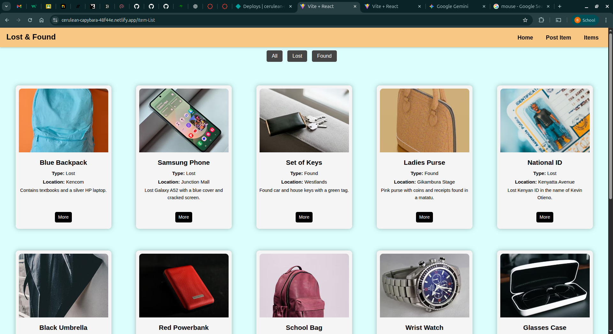

# Lost & Found Board

A user-friendly, visually modern React web application where people can post and browse lost or found items. Whether you've misplaced a wallet or discovered someone's keys, this platform helps reunite owners with their belongings.

By Group 6

---

## Description

Lost & Found Board is a React-based application that allows users to post either *Lost* or *Found* items. Each post contains essential details like the item's image, location, date, time, and contact information. The system is built with a focus on accessibility, responsiveness, and ease of use. It supports creating, viewing, and filtering items through a streamlined interface and leverages a JSON Server backend for data persistence during development.

---

## Features

* **Post an Item:** Add new items by specifying details like title, type (Lost/Found), location, description, contact info, and an optional reward.
* **View Listings:** Browse through all posted items with relevant images and quick summaries.
* **Item Details:** Click any item to see a full view with extended information.
* **Filter by Type:** Toggle between "Lost" or "Found" to narrow your search.
* **Responsive Design:** Seamlessly works across desktops, tablets, and mobile devices.

---

## Screenshot



---

## How to Use

### Requirements

* Node.js & npm
* Code Editor (e.g., VS Code)
* Terminal

### Live Site

Visit the deployed site: [Lost & Found Board on Netlify](https://cerulean-capybara-48f44e.netlify.app)

### Local Development Setup

1. **Clone the Repository:**

```bash
git clone <your-repo-url>
cd Group-6-project
```

2. **Install Frontend Dependencies:**

```bash
npm install
```

3. **Install JSON Server:**

```bash
npm install -g json-server
```

4. **Create `db.json` in Project Root:**

```json
{
  "items": [
    {
      "id": "a220",
      "title": "Black Wallet",
      "type": "Lost",
      "location": "CBD",
      "image": "https://example.com/wallet.jpg",
      "description": "Lost on Tom Mboya Street, contains ID and ATM cards.",
      "contactInfo": "0791122334",
      "DateLost": "2025-07-10",
      "TimeLost": "13:20",
      "Reward": "500"
    }
  ]
}
```

5. **Start JSON Server:**

```bash
json-server --watch db.json --port 3000
```

6. **Run the React App:**

```bash
npm run dev
```

Visit [http://localhost:5173](http://localhost:5173) in your browser.

---

## Tech Stack

* **React.js** – Component-based UI
* **React Router** – Page navigation
* **CSS** – Custom styling (dark mode supported)
* **HTML5** – Structure and content
* **Vite** – Fast React build system
* **JSON Server** – Local database for development

---

## Contact

For questions, support, or collaboration:

* Email: [group6@school.com](benson.mwanake@student.moringaschool.com)

---

## License

**MIT License**

Copyright © 2025 Group 6

Permission is hereby granted, free of charge, to any person obtaining a copy of this software and associated documentation files (the "Software"), to deal in the Software without restriction, including without limitation the rights to use, copy, modify, merge, publish, distribute, sublicense, and/or sell copies of the Software, and to permit persons to whom the Software is furnished to do so, subject to the following conditions:

The above copyright notice and this permission notice shall be included in all copies or substantial portions of the Software.

THE SOFTWARE IS PROVIDED "AS IS", WITHOUT WARRANTY OF ANY KIND, EXPRESS OR IMPLIED, INCLUDING BUT NOT LIMITED TO THE WARRANTIES OF MERCHANTABILITY, FITNESS FOR A PARTICULAR PURPOSE AND NONINFRINGEMENT. IN NO EVENT SHALL THE AUTHORS OR COPYRIGHT HOLDERS BE LIABLE FOR ANY CLAIM, DAMAGES OR OTHER LIABILITY, WHETHER IN AN ACTION OF CONTRACT, TORT OR OTHERWISE, ARISING FROM, OUT OF OR IN CONNECTION WITH THE SOFTWARE OR THE USE OR OTHER DEALINGS IN THE SOFTWARE.

---
